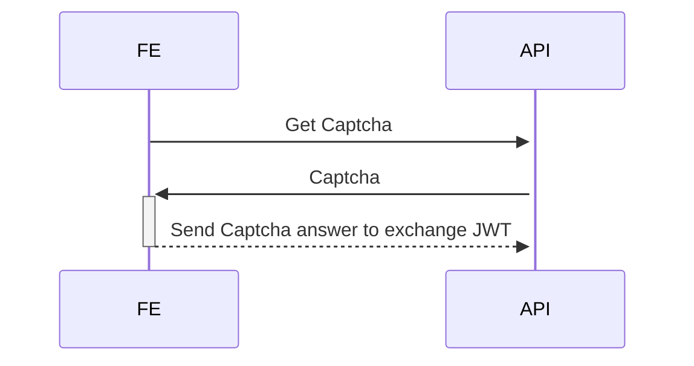

# Sample

https://hub.docker.com/r/genschsa/mysql-employees

# Todos

- security JWT token
- Logging with X-Request-ID

- GET /captchas
- POST /captchas
- GET /token
- GET /todos
- POST /todos
- PUT /todos/:id
- DELETE /todos/:id
- GET /ping
- GET /ready

Authen Flow

# exam training
captcha.Gen(1,1,1,1) 
// - pattern: 1 , 2
// - leftOperand
// - Operator : 1 = +, 2 = -, 3 = *
// - rightOperand

1,1,1,1
1 + one

2,1,1,1
one + 1

cc := captcha.New(1,1,1,1)
c.String()